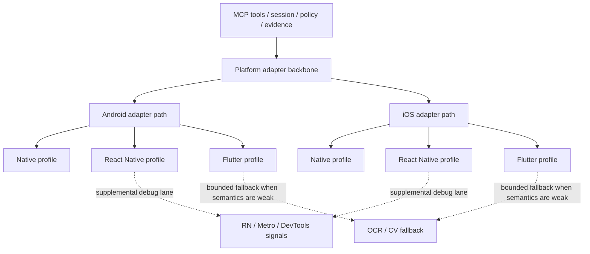

# Framework Coverage Strategy

This document separates **platform adapters** from **framework instrumentation profiles**.

## 1. Native iOS/Android Apps

Best fit:

- Deterministic tree-driven actions via platform-native automation backends.
- Strongest stability and highest assertion confidence.

Recommended defaults:

- Native-first element locators (accessibility ID, resource-id, XCUI labels/identifiers).
- Visual fallback only when labels/identifiers are insufficient.

---

## 2. React Native Apps

Use dual-lane strategy:

1. **Automation lane**: native tree interaction as primary E2E execution.
2. **Debug lane**: RN/Metro/DevTools logs and runtime signals via RN adapter.

Notes:

- RN debugger tools (e.g., Metro console log MCPs) are valuable observability adapters.
- They are not sufficient as complete E2E control backends.

---

## 3. Flutter Apps

Challenges:

- Tree quality depends on accessibility semantics and widget instrumentation.
- Some custom-rendered surfaces are harder for tree-only automation.

Approach:

- Encourage semantic labels/test IDs in Flutter widgets.
- Use deterministic tree path first.
- Use OCR/CV fallback for canvas/custom painted or insufficient semantics.

---

## 4. Cross-Framework Unification

Unify only high-level verbs:

- launchApp
- getViewTree
- tap
- typeText
- takeScreenshot
- readLogs

Expose adapter-specific escape hatches for platform/framework nuances.

---

## 5. Platform Adapter vs Framework Profile Model

Platform adapter (execution backbone):

- Android adapter
- iOS adapter

Framework profile (instrumentation quality layer):

- Native profile
- React Native profile
- Flutter profile

Framework profile determines determinism quality and fallback frequency. It does not replace the platform adapter, and it does not mean there are separate full RN or Flutter execution backends.

## 6. Layering Diagram

The current repository uses a **platform-backbone plus framework-profile** model rather than a fully separate backend per framework.

Read the diagram from top to bottom:

- MCP tools enter through the shared session/policy/evidence layer first.
- Android and iOS adapters remain the execution backbone for UI actions, app lifecycle, screenshots, logs, and flow running.
- Native / React Native / Flutter are treated as framework profiles that change instrumentation expectations, determinism quality, and fallback frequency.
- React Native adds a supplemental debug lane on top of the platform backbone; it does not replace it.
- Flutter relies more heavily on semantics quality, with bounded OCR/CV fallback only after deterministic resolution fails on the shared platform backbone.

### Current repository interpretation

- `configs/profiles/native.yaml` describes the native instrumentation baseline on top of the shared platform adapters.
- `configs/profiles/react-native.yaml` describes a validated RN sample baseline, while runtime execution still flows through Android/iOS platform control surfaces.
- `configs/profiles/flutter.yaml` describes Flutter expectations as a profile, not a separate execution backbone.
- Live `RunnerProfile` values are currently narrower than the conceptual matrix: `phase1`, `native_android`, `native_ios`, and `flutter_android`.

---

## 7. Compatibility Matrix (Template)

Maintain a matrix by:

- Platform: Android/iOS
- Runtime: emulator/simulator/real device
- Framework: native/RN/Flutter
- Automation backend: appium/maestro/native adapters
- Reliability grade: A/B/C

Add mandatory columns:

- Required app instrumentation
- Supported system-UI/webview scope
- Allowed fallback levels
- Known caveats and exclusions
