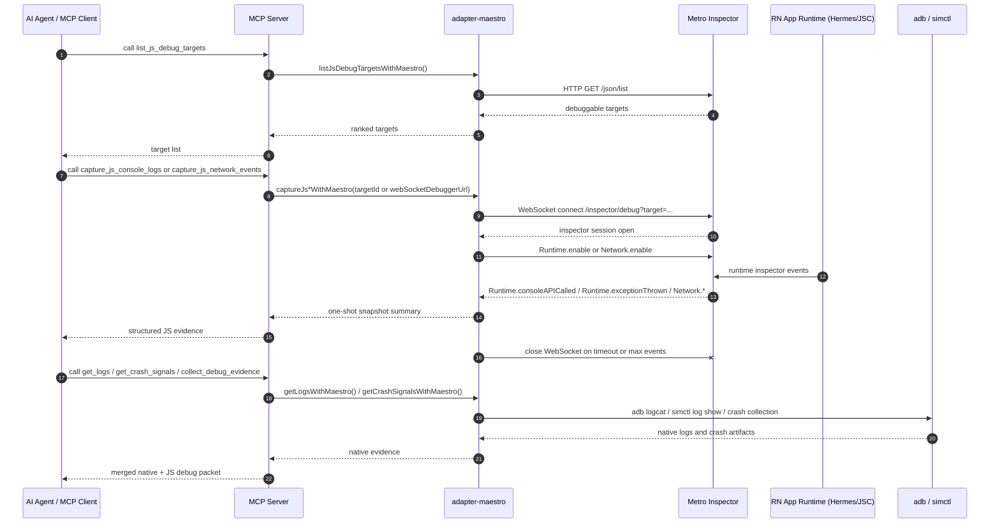

# React Native Debugger Sequence And Capability Gap

## 1. Scope

This document describes the current React Native debugging path implemented in this repository and the additional capabilities required to evolve it into a full debugger.

Current implementation status:

- Metro target discovery is implemented.
- Inspector WebSocket snapshot capture is implemented for console and network events.
- Native logs and crash evidence are collected through platform CLIs on a separate path.
- Full interactive debugging is not implemented.

Relevant implementation files:

- `packages/adapter-maestro/src/js-debug.ts`
- `packages/adapter-maestro/src/device-runtime.ts`
- `packages/adapter-maestro/src/index.ts`
- `packages/mcp-server/src/stdio-server.ts`

## 2. Current Sequence

## 3. Important Boundary

The repository does not start a general-purpose WebSocket server that waits for the mobile app to push logs into it.

The actual direction is:

1. Metro already exposes discovery and inspector endpoints.
2. This project acts as an HTTP client for `/json/list`.
3. This project acts as a WebSocket client for `/inspector/debug?target=...`.
4. The mobile app runtime is attached to Metro's inspector channel.
5. Native logs are collected independently through `adb` or `xcrun simctl`, not through the inspector WebSocket.

That means the current design is an observability adapter over Metro inspector, not a standalone debugger backend.

## 4. What Exists Today

Implemented debugger-adjacent capabilities:

- JS target discovery from Metro `/json/list`
- Target ranking and selection heuristics
- One-shot console snapshot via `Runtime.consoleAPICalled`
- One-shot exception snapshot via `Runtime.exceptionThrown`
- One-shot network snapshot via `Network.*`
- Native log capture through `adb logcat` and simulator log commands
- Merged debug evidence packet through `collect_debug_evidence`

Current limitations:

- No persistent debug session
- No pause/resume/step control
- No breakpoint management
- No `Runtime.evaluate`
- No script/source retrieval workflow
- No source map or symbolication pipeline
- No streaming event timeline UI
- No response body inspection, HAR export, or deep network replay

## 5. Capability Gap To A Full Debugger

To upgrade this path into a full debugger, the project needs several additional layers.

### 5.1 Persistent Inspector Session Management

Required additions:

- Long-lived attach/detach session model instead of one-shot snapshot capture
- Reconnect handling when the app reloads, Metro restarts, or target IDs rotate
- Multi-target session management for app runtime, Chrome proxy targets, and Expo targets
- Session heartbeat and liveness detection
- Explicit ownership rules for who currently controls pause/resume state

Why it matters:

Without a persistent session layer, every tool call is stateless. That is enough for snapshots, but not for interactive debugging.

### 5.2 Full DevTools Protocol Coverage

Required additions:

- `Debugger.enable`
- `Debugger.setBreakpointByUrl` and breakpoint lifecycle management
- `Debugger.pause`, `Debugger.resume`, `Debugger.stepInto`, `Debugger.stepOver`, `Debugger.stepOut`
- `Debugger.setPauseOnExceptions`
- `Runtime.evaluate`
- `Runtime.getProperties`
- `Runtime.callFunctionOn`
- `Runtime.releaseObjectGroup`
- `Page`, `Profiler`, and possibly `HeapProfiler` support where available
- `Network.getResponseBody` and richer request/response correlation

Why it matters:

Today the implementation only subscribes to events. A full debugger must also send state-changing protocol commands and maintain object references safely.

### 5.3 Runtime State And Object Inspection

Required additions:

- Execution context tracking across reloads
- Call stack inspection beyond exception snapshots
- Scope chain and local variable inspection
- Remote object handles and preview formatting
- Async stack support where Metro/engine support it
- Watch expressions and pinned evaluated values

Why it matters:

Breakpoint debugging is useful only when the operator can inspect stack frames, locals, closures, and object graphs at the paused point.

### 5.4 Source Retrieval, Symbolication, And Mapping

Required additions:

- Script inventory and source retrieval
- Bundle URL to local file path mapping
- Source map loading and caching
- Hermes stack symbolication pipeline
- Breakpoint binding against original source locations instead of bundle offsets
- Stable source identity across reloads and code pushes

Why it matters:

Without symbolication and source mapping, a pause event often lands on generated bundle code, which is not workable for real debugging.

### 5.5 Debugger-Oriented Network Tooling

Required additions:

- Full request lifecycle timeline
- Headers, timing, and body retrieval
- Streaming WebSocket frame inspection if supported
- HAR-like export
- Request filtering and domain scoping
- Correlation between network failures and UI or runtime events

Why it matters:

The current network layer only retains a failure-oriented summary. A debugger-grade network panel needs much richer payload access and timing information.

### 5.6 Event Streaming And Time-Ordered Timeline

Required additions:

- Continuous event stream instead of timeout-bounded snapshots
- Cross-domain timeline merging for console, exceptions, network, reloads, and native logs
- Resume-from-offset or incremental subscription semantics
- Backpressure handling and bounded buffering
- Artifact persistence for long-running sessions

Why it matters:

A real debugger is not just command support. It also needs stable chronology, otherwise event causality is hard to reason about.

### 5.7 Source-Level User Experience Layer

Required additions:

- Breakpoint persistence and labeling
- Paused-state presentation model
- Pretty printing for bundled sources where necessary
- Search across loaded scripts
- Error and exception navigation
- Stack frame selection model
- Variable tree expansion model

Why it matters:

Even if the protocol layer exists, teams still need a coherent operator-facing model for source navigation and paused state inspection.

### 5.8 Device And App Lifecycle Integration

Required additions:

- Automatic Metro reachability checks before debugger attach
- Automatic target refresh after hot reload or full reload
- Clear handling for foreground/background transitions
- Real-device connection validation and tunnel assumptions
- Optional app-side hooks for deterministic attach points

Why it matters:

RN runtimes are more volatile than browser tabs. Reloads, reconnects, and target churn are normal and must be first-class in the debugger model.

### 5.9 Governance And Safety

Required additions:

- Policy gates around `Runtime.evaluate` and arbitrary code execution
- Secret and token redaction for logs, headers, and response bodies
- Audit trail for breakpoint changes and evaluated expressions
- Environment-specific capability profiles, for example read-only inspect vs full control

Why it matters:

A snapshot collector is low risk. A full debugger can execute code, inspect secrets, and capture sensitive payloads, so the policy model has to become stricter.

## 6. Recommended Evolution Path

A pragmatic upgrade path for this repository is:

1. Keep the current snapshot tools as low-risk observability primitives.
2. Add a persistent inspector session tool family with explicit attach/detach semantics.
3. Add `Runtime.evaluate` and paused-state inspection before breakpoint authoring.
4. Add breakpoint lifecycle and stepping support.
5. Add source mapping and symbolication.
6. Add streaming timeline and richer network payload access.
7. Add governance controls before enabling full debugger access by default.

This order keeps current value intact while avoiding a premature jump from "snapshot adapter" to "full debugger shell" without the required control, mapping, and governance layers.
