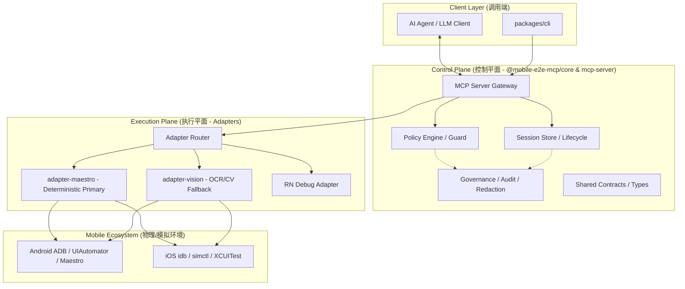

# Mobile E2E MCP 系统架构概览

本文档整理了项目的核心架构设计，旨在帮助开发者快速理解各层级之间的协作关系。

## 1. 整体架构图

## 2. 核心分层职责

### 2.1 控制平面 (Control Plane)
- **MCP Server (`packages/mcp-server`)**: 暴露 40+ 个原子化工具。负责协议转换、工具注册和初步的输入校验。
- **Core (`packages/core`)**: 系统的大脑。
    - **Policy Engine**: 执行治理逻辑，确保 AI 的行为在安全范围内。
    - **Session Store**: 持久化执行序列、证据包（截图、日志）和状态快照。
    - **Governance**: 处理敏感数据脱敏和审计存证。
- **Contracts (`packages/contracts`)**: 定义了全栈共享的 TypeScript 类型，确保 AI、Server 和 Adapter 之间的契约一致性。

### 2.2 执行平面 (Execution Plane)
- **Maestro Adapter (`packages/adapter-maestro`)**:
    - **确定性优先**: 优先通过 UI Tree (XML/JSON) 进行元素定位。
    - **原生通信**: 直接调用 ADB (Android) 和 idb/simctl (iOS) 的底层命令。
- **Vision Adapter (`packages/adapter-vision`)**:
    - **OCR 兜底**: 当 UI 树失效时，使用 macOS Vision 框架进行文字识别。
    - **模糊匹配**: 处理 UI 变动带来的不确定性。

## 3. 关键特性

- **Deterministic-first**: 拒绝盲目 OCR。系统强制要求优先走 ID/Text 匹配的确定性路径，只有在失败且满足 Policy 门禁时才回退到视觉。
- **Evidence-rich**: 每一个 Action 都会自动关联截图、UI 树快照和设备日志，支持 AI 进行失效分析（Explain Failure）。
- **Governance-aware**: 所有的移动端交互都受到 Policy Guard 的监控，支持对敏感页面进行脱敏或操作拦截。

## 4. 开发指引

了解代码细节的最佳入口（建议按此顺序阅读）：
- 第一入口：`repomix-output.xml`（整合代码全景，先建立上下文）
- 第二步：`git ls-files` + 定向文件读取（核对 repomix 与当前仓库差异）
- 核心逻辑：`packages/adapter-maestro/src/index.ts`
- 工具定义：`packages/mcp-server/src/tools/`
